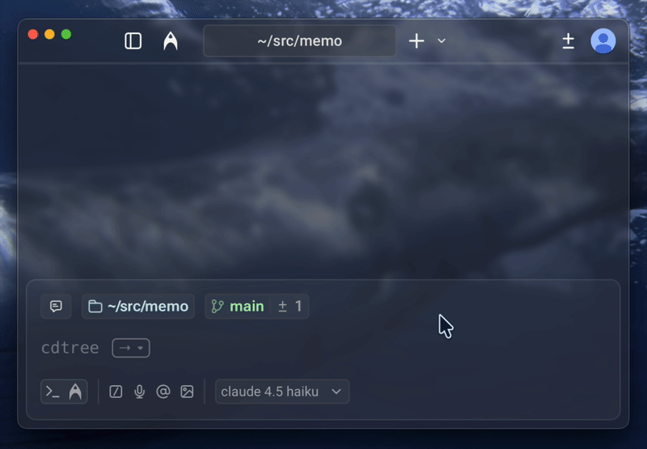

<p align="center">
  
</p>

# cdtree

A simple CLI tool to navigate directories with a tree view, similar to `tree` but interactive. It allows you to select a directory and change to it in your shell.

## Features

- Tree-like view starting at your home directory, auto-expanded to the current directory.
- Navigate using arrow keys (`Up`, `Down`, `Left`, `Right`).
- Enter to select a directory (files are ignored).
- Shell integration to change the parent directory.
- Broot-style automatic configuration.

<div align="center">
  
</div>

## Installation

### Homebrew (macOS)

```bash
brew install shogoisaji/cdtree/cdtree
```

### Cargo

Requires Rust and Cargo.

```bash
cargo install --path .
```

## Setup (Shell Integration)

1. Run the setup once:

```bash
cdtree --setup
```

2. Reload your shell config:

```bash
source ~/.zshrc
```

If you use Bash, source `~/.bashrc` instead.

## Usage

Simply run:

```bash
cdtree
```

- **Up/Down**: Move selection.
- **Right**: Expand directory.
- **Left**: Collapse directory or go to parent.
- **Enter**: Change to the selected directory (only when a directory is selected).
- **f**: Toggle file visibility.
- **h**: Toggle hidden file visibility.
- **q / Esc**: Quit.
